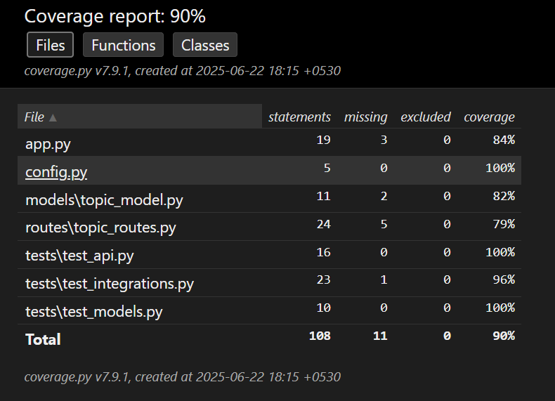

# StudySync API

A lightweight Flask-based REST API with a simple frontend for managing academic topics, notes, and completion status. This project helps users track study material efficiently using MongoDB and Python.

## Features

- REST API with Flask for topic tracking
- MongoDB database integration
- Frontend interface using HTML, CSS, and vanilla JavaScript
- Full CRUD support: Create, Read, Update, Delete

## Endpoints

| Method | Endpoint            | Description                     |
|--------|---------------------|---------------------------------|
| GET    | `/topics`           | Get all study topics            |
| POST   | `/topics`           | Add a new topic                 |
| PUT    | `/topics/<id>`      | Update topic details/status     |
| DELETE | `/topics/<id>`      | Delete a topic                  |

## Sample POST Body

```json
{
  "title": "A* Search",
  "subject": "AI",
  "notes": "Best-first search with heuristics"
}
```

## Tech Stack

- Flask
- PyMongo
- MongoDB
- HTML + JavaScript + CSS

## Installation

```bash
git clone https://github.com/yourusername/studysync-api.git
cd studysync-api
python -m venv venv
source venv/bin/activate  # Windows: venv\Scripts\activate
pip install -r requirements.txt
```

Create a `.env` file:
```env
MONGO_URI=mongodb://localhost:27017/studysync
```

## Running the Server

```bash
python app.py
```

Visit: http://localhost:5000

## Frontend

The frontend is served via Flask using:

- `templates/index.html`
- `static/script.js` for JS logic
- `static/style.css` for styling

### How to Use

1. Open http://localhost:5000
2. Fill out the form to add a new topic
3. View the list below with options to delete
4. Data updates are sent to your Flask API in real time

## Project Structure

```
studysync-api/
├── app.py
├── config.py
├── models/
├── routes/
├── static/
│   ├── script.js
│   └── style.css
├── templates/
│   └── index.html
├── .gitignore
├── .env
├── requirements.txt
└── README.md
```

## 🧪 Testing
This project includes unit, integration, and API tests using Python’s built-in unittest framework.

Tools Used

  1. unittest – Core test framework for Python

  2. unittest.mock – Used for mocking database operations in unit tests

  3. coverage – To calculate test coverage

How to Run Tests

```bash
python -m unittest discover -s tests
```

How to Check Coverage
```bash
coverage run -m unittest discover -s tests
coverage report
```

Coverage Report
    


## 🧪 Keploy Test Results

Keploy captured 4 tests from real API traffic and replayed them automatically.

| Test ID   | Status  |
|-----------|---------|
| test-1    | ✅ Passed |
| test-2    | ❌ Failed |
| test-3    | ❌ Failed |
| test-4    | ❌ Failed |

**Test Set:** `test-set-1`  
⏱ Duration: `5.03s`  


## Created by
Ali Rizvi  
for Keploy API Fellowship Task 2  
